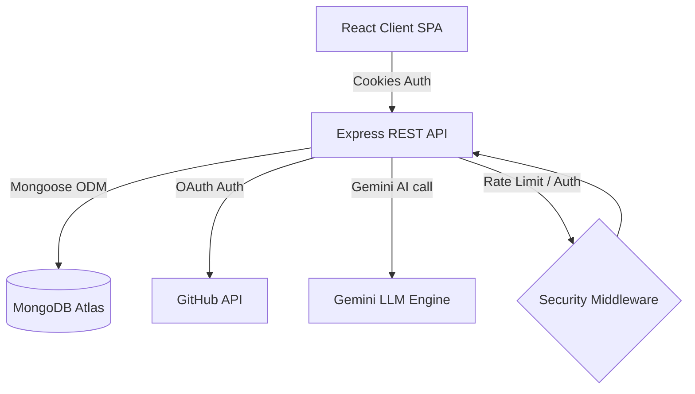

# System Architecture Specifications

DevForge AI is built on a clean decoupled architecture, partitioning responsibilities between a React UI engine and an Express REST server communicating over a session-safe cookie interface.

---

## 🏗️ 1. Complete Architecture Design



### Decoupled Layers:
1. **Presentation Layer**: Client dashboard constructed using React, styling tokens (Tailwind), custom SVG indicators, and iframe sandboxes to prevent template script injection.
2. **Controller Routing Layer**: Endpoint routers verifying request rates, cookies, roles (RBAC), and sanitizing payload values.
3. **Services Layer**: Isolated service scripts (`geminiService`, `atsService`, `resumeParser`) decoupling DB logic from third-party pings.
4. **Database Storage Layer**: MongoDB collections structured with custom TTL document deletions and compound filters indices.

---

## 🔒 2. Security & Session Integrity

### Cookie JWT Sessions:
- Access tokens are encapsulated inside `HttpOnly`, `SameSite=Lax`, and `Secure` (in production) cookies, blocking cross-site scripting (XSS) extraction.
- GitHub access tokens are encrypted using **AES-256-CBC** before database storage, preventing raw credential leakage in case of database intrusion.

### Endpoint Rate Limiting:
- Rate limit thresholds prevent server compute overload:
  - Auth routes: 30 requests per 15 minutes.
  - AI routes: 50 requests per 15 minutes.
  - Admin routes: 100 requests per 15 minutes.

---

## ⚡ 3. Gemini Cache Hashing

To avoid redundant LLM billing, the application employs a SHA-256 cache hashing algorithm:

```text
Prompt Text + Model + Version Constant + Raw Inputs
                   ↓
              SHA-256 Hash
                   ↓
        Query GeminiCache Collection
        ├── [FOUND] --> Return Cached Response (cacheHit: true)
        └── [MISS]  --> Invoke Gemini API, Save response (cacheHit: false)
```

- When prompt templates are modified, developers increment their version constants (e.g. `VERSION = 'v1.1'`). This automatically invalidates all stale caches on the next call.
- Usage telemetry logs (`AIUsage`) record token sizes, feature keys, and models to compile cost savings estimates dynamically in the admin console.

---

## 📊 4. Database Schema Indexes

### `UserActivity`
- Compound Index: `{ userId: 1, createdAt: -1 }` and `{ action: 1, createdAt: -1 }` to optimize activity feeds.
- TTL Index:
  ```javascript
  UserActivitySchema.index({ createdAt: 1 }, { expireAfterSeconds: 31536000 });
  ```
  Deletes activity entries older than 365 days automatically.

### `User`
- Compound Index: `{ role: 1, isActive: 1 }` to accelerate directory search and auth checks.

### `Portfolio`
- Compound Index: `{ userId: 1, isDeleted: 1 }` to accelerate owner searches while excluding moderated layouts.

### `AdminAuditLog`
- Index: `{ createdAt: -1 }` to order logging histories chronologically.
